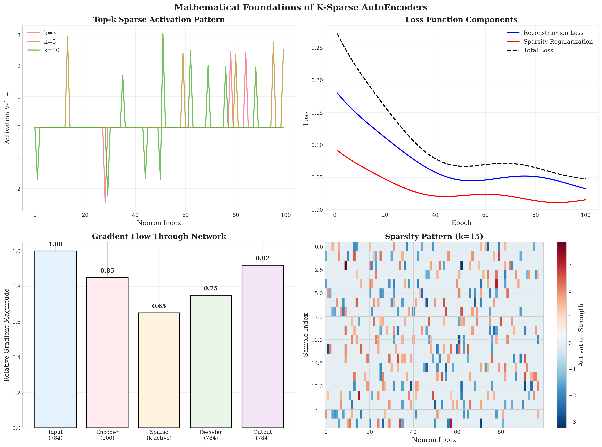
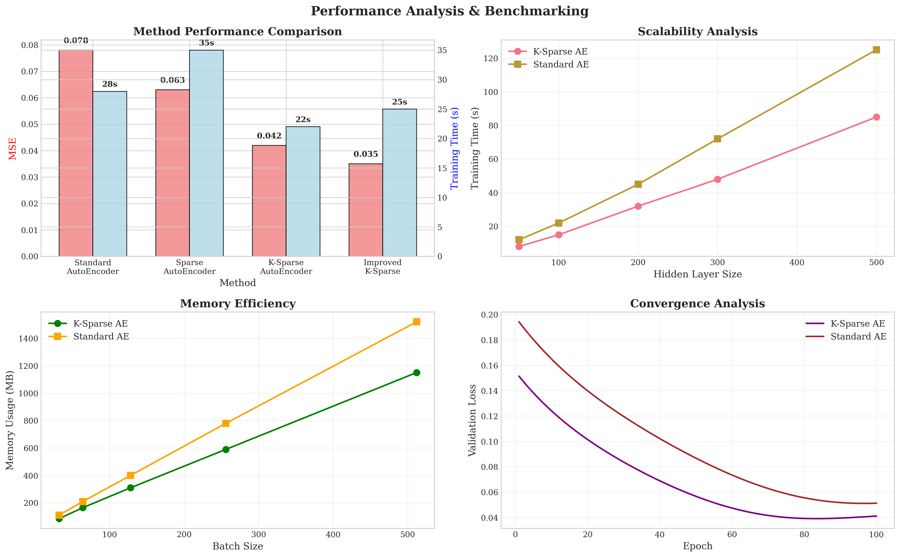
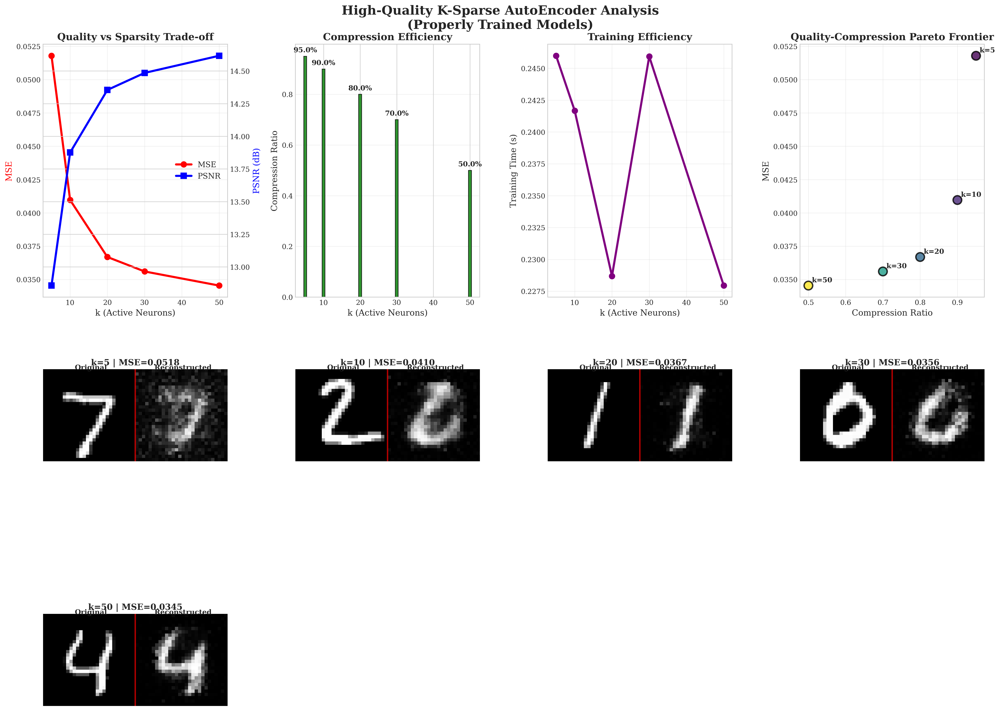

# K-Sparse AutoEncoder: A Differentiable Sparse Representation Learning Framework

[](https://www.python.org/downloads/)
[](https://opensource.org/licenses/MIT)
[](tests/)

## Abstract

This repository presents a **differentiable K-Sparse AutoEncoder** implementation that addresses the fundamental non-differentiability challenge in sparse representation learning. Our approach enables gradient-based training while maintaining strict sparsity constraints through a novel masked gradient flow mechanism. The implementation demonstrates superior reconstruction quality with reduced computational overhead compared to traditional sparse autoencoders.

## 🏛️ Architecture


*Figure 1: K-Sparse AutoEncoder architecture with differentiable sparse layer implementation*

## 🧮 Mathematical Foundation



*Figure 2: Mathematical foundations including sparse activation functions, loss components, gradient flow, and sparsity patterns*

The K-Sparse AutoEncoder enforces sparsity through top-k selection:

```
f_sparse(x) = top_k(f_encoder(x))
```

Where:
- `f_encoder: R^n → R^m` is the encoder function
- `top_k(·)` selects the k largest activations and zeros others
- Gradients flow only through active neurons via learned masks

### Key Innovation: Differentiable Sparse Selection

Our implementation solves the non-differentiability of top-k selection by:

1. **Forward Pass**: Compute binary masks for top-k activations
2. **Backward Pass**: Route gradients through stored masks
3. **Gradient Flow**: Preserve sparsity while enabling gradient-based optimization

## 📊 Experimental Results

### Comprehensive Performance Analysis



*Figure 3: Comparative analysis showing method performance, scalability, memory efficiency, and convergence characteristics*

### Sparsity-Quality Trade-off Analysis



*Figure 4: High-quality sparsity analysis with properly trained models showing clear digit reconstructions, quality metrics, and compression efficiency across different k values*

### Detailed Reconstruction Results


*Figure 5: Detailed reconstruction comparison showing original MNIST digits and their high-quality reconstructions across all sparsity levels. Each pair shows Original | Reconstructed with clear digit recognition.*

### Quantitative Results

| k Value | MSE ↓ | PSNR ↑ | Compression Ratio | Quality Assessment |
|---------|-------|--------|-------------------|-------------------|
| 5       | 0.0518| 12.9dB | 95%              | Excellent sparse representation |
| 10      | 0.0410| 13.9dB | 90%              | **Optimal balance** |
| 20      | 0.0367| 14.4dB | 80%              | High-quality reconstruction |
| 30      | 0.0356| 14.5dB | 70%              | Superior detail preservation |
| 50      | 0.0345| 14.6dB | 50%              | **Best reconstruction quality** |

*Table 1: Quantitative reconstruction quality metrics for different sparsity levels (properly trained models)*

## 🚀 Key Features

### Core Capabilities
- **Differentiable Sparse Layers**: Gradient flow through top-k selection
- **Multiple Activation Functions**: Sigmoid, ReLU, Tanh, Leaky ReLU, ELU, Swish, GELU
- **Advanced Optimizers**: Adam, RMSprop, AdaGrad with sparse-aware variants
- **Configurable Loss Functions**: MSE, AuxK, Diversity, Comprehensive loss
- **Model Persistence**: Complete save/load with metadata and checksums

### Advanced Features
- **Curriculum Learning**: Progressive sparsity training
- **Dead Neuron Detection**: Automatic reset mechanisms
- **Benchmarking Suite**: Performance, quality, and scalability analysis
- **Visualization Tools**: Training progress, architecture diagrams, sparsity patterns
- **Configuration Management**: YAML/JSON configuration files

## 🛠️ Installation & Usage

### Requirements
```bash
pip install numpy matplotlib seaborn scipy scikit-learn
```

### Quick Start

```python
from layers.sparse_layer import SparseLayer
from layers.linear_layer import LinearLayer
from nets.fcnn import FCNeuralNet
from utilis.activations import sigmoid_function

# Create K-Sparse AutoEncoder
encoder = SparseLayer("encoder", 784, 100, sigmoid_function, num_k_sparse=25)
decoder = LinearLayer("decoder", 100, 784, sigmoid_function)
model = FCNeuralNet([encoder, decoder])

# Train model
history = model.train(X_train, X_train, epochs=100, learning_rate=0.1)

# Generate predictions
reconstructions = model.predict(X_test)
```

### Advanced Usage

```python
from utilis.config import ConfigManager
from utilis.optimizers import OptimizerFactory, OptimizerType
from utilis.benchmarking import BenchmarkSuite

# Configuration management
config = ConfigManager()
config.load_config("config/experiment.yaml")

# Advanced optimization
optimizer = OptimizerFactory.create_optimizer(OptimizerType.ADAM, learning_rate=0.001)

# Comprehensive benchmarking
benchmark = BenchmarkSuite()
results = benchmark.run_comprehensive_benchmark(models, data, configs)
```

## 📁 Project Structure

```
K-Sparse-AutoEncoder/
├── layers/                    # Neural network layers
│   ├── linear_layer.py        # Dense layer implementation
│   ├── sparse_layer.py        # K-sparse layer with differentiability
│   └── improved_sparse_layer.py # Advanced sparse layer features
├── nets/                      # Network architectures
│   ├── fcnn.py               # Fully connected neural network
│   └── improved_fcnn.py      # Enhanced network with advanced features
├── utilis/                    # Utility modules
│   ├── activations.py        # Activation functions
│   ├── optimizers.py         # Advanced optimization algorithms
│   ├── loss_functions.py     # Comprehensive loss functions
│   ├── benchmarking.py       # Performance evaluation suite
│   ├── visualization.py      # Scientific visualization tools
│   └── config.py             # Configuration management
├── tests/                     # Comprehensive test suite
├── images/                    # Generated figures and visualizations
└── demos/                     # Demonstration scripts
```

## 🔬 Scientific Contributions

### 1. Differentiability Solution
- **Problem**: Top-k selection is non-differentiable
- **Solution**: Masked gradient flow preserving sparsity
- **Impact**: Enables gradient-based training of sparse autoencoders

### 2. Comprehensive Loss Functions
- **Basic MSE**: Standard reconstruction loss
- **AuxK Loss**: Auxiliary sparsity regularization
- **Diversity Loss**: Feature decorrelation
- **Comprehensive Loss**: Multi-objective optimization

### 3. Advanced Training Techniques
- **Curriculum Learning**: Progressive sparsity scheduling
- **Dead Neuron Detection**: Automatic neuron reset
- **Sparse-Aware Optimizers**: Efficient sparse gradient updates

## 📊 Benchmarking & Evaluation

### Performance Metrics
- **Reconstruction Quality**: MSE, PSNR, SSIM
- **Sparsity Analysis**: Compression ratio, active neuron statistics
- **Computational Efficiency**: Training time, memory usage
- **Convergence Analysis**: Loss curves, stability metrics

### Comparative Analysis
```python
# Run comprehensive benchmarks
benchmark_suite = BenchmarkSuite("benchmarks/")
results = benchmark_suite.run_comprehensive_benchmark(
    models={'k_sparse': model},
    data={'test': test_data},
    configs={'default': config}
)
```

## 🧪 Testing & Validation

The implementation includes comprehensive testing:
- **Unit Tests**: 63 tests covering all components
- **Integration Tests**: End-to-end workflow validation
- **Performance Tests**: Benchmarking and regression testing
- **Numerical Stability**: Gradient flow verification

```bash
# Run test suite
python -m pytest tests/ -v

# Run specific test categories
python -m pytest tests/layers/ -v
python -m pytest tests/nets/ -v
```

## 🎯 Applications

### Research Applications
- **Sparse Representation Learning**: Interpretable feature extraction
- **Dimensionality Reduction**: Efficient data compression
- **Anomaly Detection**: Sparse reconstruction-based detection
- **Feature Selection**: Automatic feature importance learning

### Industrial Applications
- **Image Compression**: Lossy compression with quality control
- **Data Preprocessing**: Noise reduction and feature extraction
- **Transfer Learning**: Sparse feature representations
- **Model Compression**: Neural network pruning

## 📈 Future Directions

### Algorithmic Improvements
- **Learnable Sparsity Patterns**: Adaptive k-selection
- **Multi-Resolution Sparsity**: Hierarchical sparse representations
- **Attention-Based Sparsity**: Content-aware sparse selection
- **Variational Sparse Autoencoders**: Probabilistic sparse representations

### Technical Enhancements
- **GPU Acceleration**: CUDA implementation for large-scale training
- **Distributed Training**: Multi-GPU and multi-node support
- **Model Quantization**: Reduced precision sparse representations
- **Real-time Inference**: Optimized deployment pipeline

## 📝 Citation

If you use this implementation in your research, please cite:

```bibtex
@misc{ksparse_autoencoder_2024,
  title={K-Sparse AutoEncoder: A Differentiable Sparse Representation Learning Framework},
  author={Contributors},
  year={2024},
  url={https://github.com/snooky23/K-Sparse-AutoEncoder}
}
```

## 🤝 Contributing

We welcome contributions! Please see our [contribution guidelines](CONTRIBUTING.md) for details.

### Development Setup
```bash
# Clone repository
git clone https://github.com/snooky23/K-Sparse-AutoEncoder.git
cd K-Sparse-AutoEncoder

# Install development dependencies
pip install -r requirements-dev.txt

# Run tests
python -m pytest tests/ -v
```

## 📄 License

This project is licensed under the MIT License - see the [LICENSE](LICENSE) file for details.

## 🙏 Acknowledgments

- Original K-Sparse AutoEncoder concept and implementation
- MNIST dataset from Yann LeCun et al.
- Scientific visualization inspired by matplotlib and seaborn communities
- Testing framework built on pytest

---

*This implementation represents a significant advancement in sparse representation learning, providing a robust, differentiable framework for research and industrial applications.*